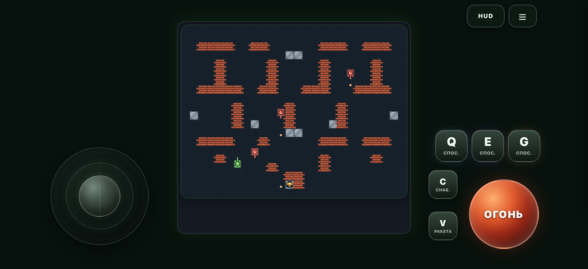
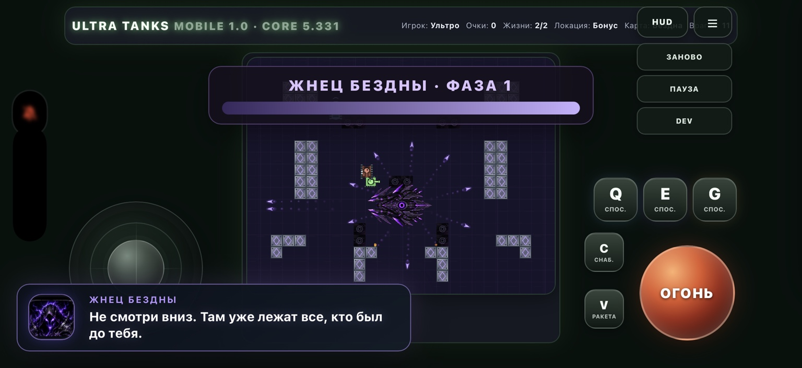

  

<h1 align="center">ULTRA TANKS MOBILE</h1>

  <b>The mobile adaptation of Ultra Tanks PC — rebuilt for touch controls on iPhone and iPad.</b>

  
  
  
  

  <a href="https://ultra-tanks.oleg-moderer.workers.dev/"><b>▶ PLAY MOBILE VERSION</b></a>

---

## About

**Ultra Tanks Mobile** brings the full-scale idea of Ultra Tanks PC to a touchscreen format.

The game keeps the campaign, vehicles, bosses, abilities, strategic progression and large encounters of the PC version, while the interface has been redesigned around mobile play: a large analog joystick, dedicated firing control, touch buttons for special abilities and a HUD that can be collapsed when you want a cleaner battlefield.

It is designed primarily for **landscape play on iPhone and iPad**, so the controls stay around the edges while the battlefield remains readable in the center.

---

## Touch controls

- **Analog movement joystick** — move naturally in any direction with your thumb.
- **Large FIRE button** — positioned for quick right-hand access.
- **Q / E / G** — dedicated touch buttons for vehicle abilities.
- **C / V** — support and missile-system controls.
- **Collapsible HUD** — hide secondary interface elements when they are not needed.
- **Landscape layout** — interface elements stay around the battlefield instead of covering the action.

  

---

## Built from Ultra Tanks PC

The mobile build is based on the **Ultra Tanks PC Core 5.331** and adapts its content to touchscreen play rather than creating a cut-down mobile edition.

That means the mobile version follows the same core game while adding a dedicated interface for phones and tablets.

  <b>Ultra Tanks — PC-scale tank combat, rebuilt for touch.</b>

